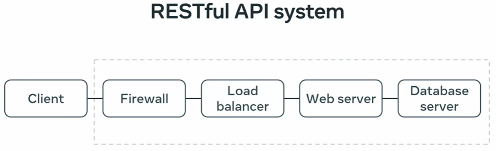

# Week 1: Rest APIs

In the first week, you will start with an overview of how APIs are used in the real world and a refresher on HTTP and HTTPS before you cover the basics of REST architecture and RESTful APIs. 

After completing the lesson items, you will be able to:

- Identify the key characteristics, benefits and uses of REST APIs

- Create API routes according to correct naming conventions and best practices

- Explain the principles of authentication in a REST API

- Differentiate between authentication and authorization

- Explain the API request lifecycle

- Create a basic API and organize an API project

- Explain different types of API output, like JSON and XML

- Use various tools for API development

HTTP 

- HTTPS is the secure way
- Client and server --> 2 elements required
- Encrypts data and then descripts the data and process it.
- The server encrypts the data and then it is descrupted to show the data in the Client. 

Methods:

- GET: retrieve
- POST: Create
- PUT: Update
- PATCH: Partially updates
- DELETE: delete 

Request structure:

Version type
URL
Method
Headers
Body: 

HTTP Response:

- The resource
- Content lenght
- Type
- Headers
- Etags
- Time last modified
- Status code 

100 199 informational
200 299 succesful
300 399 redirection

400 client error

- Bad api request
- The resource is not present in the server

500 server error

- lacks error checks
- configuration mismatch
- Packagage dependencies issues

# REST API

- ITs a gatewat for acceding a DB
- REST: Easy to learn and quick to develop

Constraints:
1. Client-Server archi
2. Stateless: No prior info included 
3. Cacheable: Responses can be saved --> Reduce server load
4. Layered: Split into layers 

5. Uniform interface: Uniforme communication system to access the resources.. Unirque URLS and unified procedures
6. Optimal code on demand: Business logic

# Naming Conventions 

endpoint = url_path 

Use: 
- lowercase letters
- hyphens in between words 
- API with variable camelCase (orderId)

/orders/{ordersId}/menu-items

- forward slashes -> in order based on the DB 

- nouns --> uses nouns not verbs 

nunca debo incluir el formato del archivo en mi API. Lo que sí es aceptable es lo siguiente:

query string parameter: 

/orders/{orderId}?format=json

no trailigin slah: No acabar con un slash al final de la API

Rules:

- Rule 01: Everything in lowercase, with hyphens and not abridged 
- Rule 02: Use a forward slash to indicate a hierarchical relationship
- Rule 03: Use nouns for resource names, not verbs
- Rule 04: Avoid special characters 
- Rule 05: Avoid file extensions in URI
- Rule 06: Use query parameters to filter when necessary 
- Rule 07: No trailing slash

